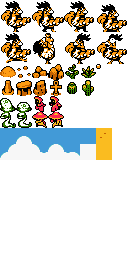

Mozilla runner
=============

Mozilla like runner for js13k 2018.

https://romualdk.github.io/games/2018/mozilla-runner/

UNFINISHED
----------

It's more like mockup but I wish I could make it to the end ;-).

INFO
----

Tileset and sound are base64 encoded and hard coded in "game.js".

Tileset is grayscale and colored on demand.

Different color palettes are assigned to sectors of tileset.

CREDITS
-------

"Players" by me ;-)

"Blowhard 2 Blow Harder" by surt
https://opengameart.org/content/blowhard-2-blow-harder

"Seasonal Platformer Tiles" by GrafxKid
https://opengameart.org/content/seasonal-platformer-tiles